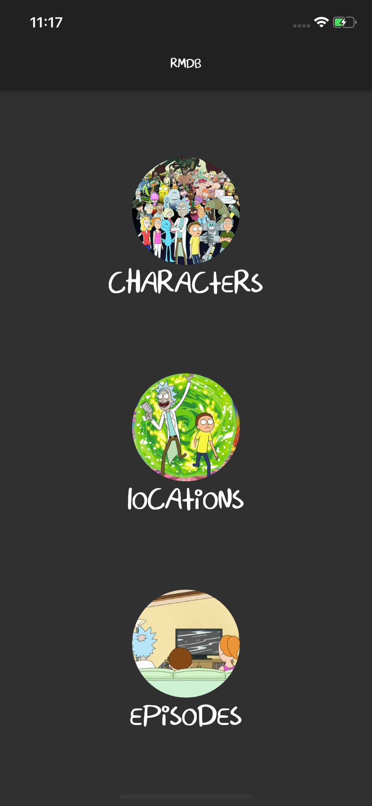
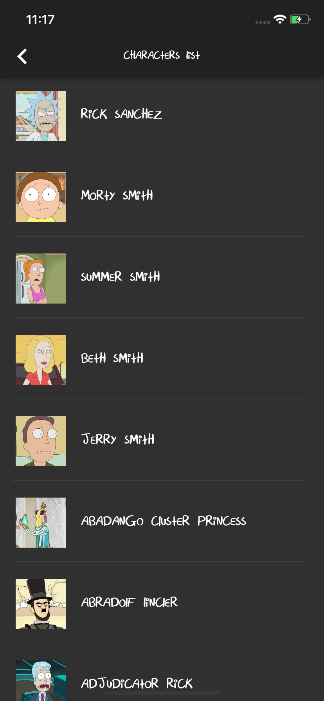
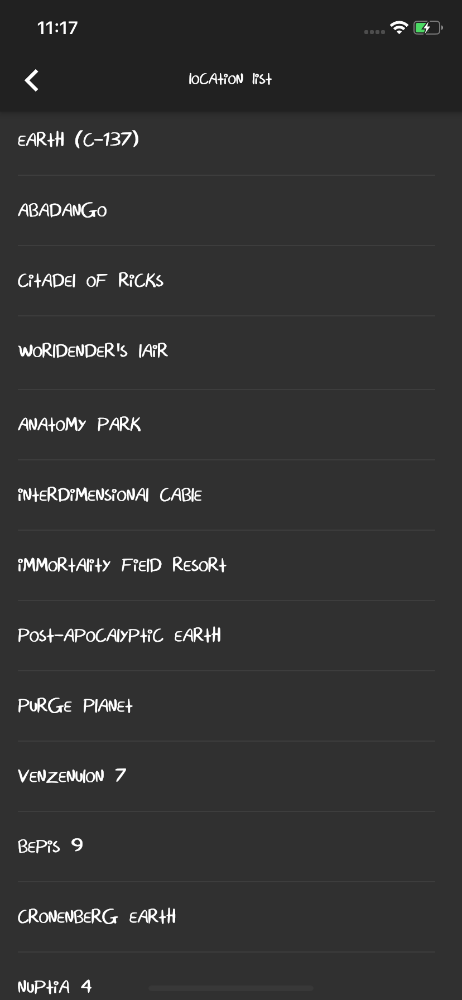
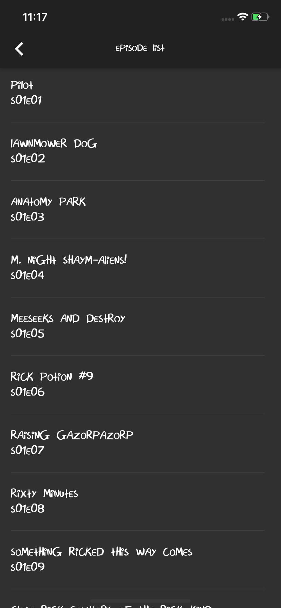
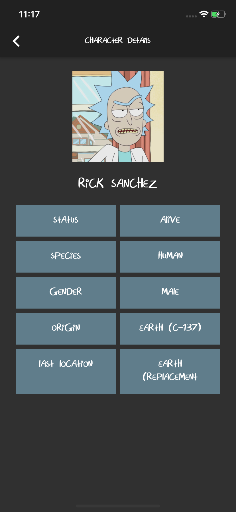
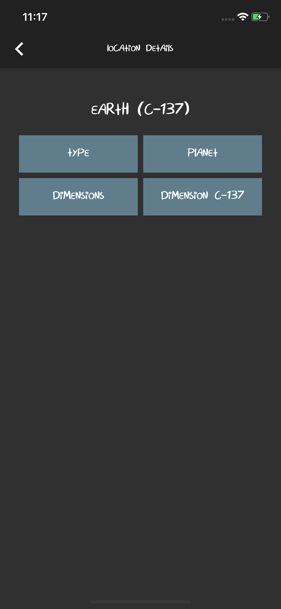

# Rick and Morty Flutter App 

A new Flutter application with pagination.

## Getting Started

This project is a starting point for a Flutter application.

A few resources to get you started if this is your first Flutter project:

- [Lab: Write your first Flutter app](https://flutter.dev/docs/get-started/codelab)
- [Cookbook: Useful Flutter samples](https://flutter.dev/docs/cookbook)

For help getting started with Flutter, view our
[online documentation](https://flutter.dev/docs), which offers tutorials,
samples, guidance on mobile development, and a full API reference.  

## API Endpoints Used

Please refer https://rickandmortyapi.com/

## Contribute 

Want to contribute? Great!  

## Screenshots 

